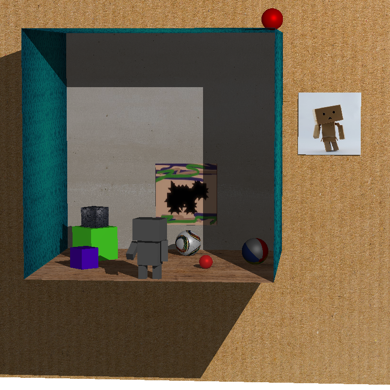

# A 3D Graphics Scene Renderer

This project is a Java program that demonstrates coordinate transformations, ray tracing, illumination, shading, and texture mapping to render a 3D graphics scene. 
The project includes the rendering of basic shapes such as planes and spheres, with additional features like shadows and texture mapping.

## Features

1. **Basic Surfaces**
   - A plane surface with a texture applied.
   - A uniform color sphere with a shiny surface (specular highlight).
   - A textured sphere (e.g., a beach ball).
   - A uniformly colored cube correctly placed and shaded in the scene.

2. **Graphics Scene**
   - Creation of a scene using multiple instances of planes, spheres, and cubes.
   - Incorporation of creative elements and placements to build an impressive scene.

3. **Shadowing**
   - Implementation of shadows for objects in the scene using a single point light source.
   - Use of ambient light to soften the shadows.

## Final Scene  

